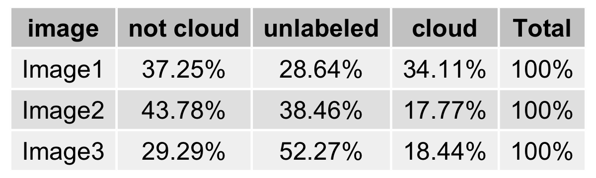
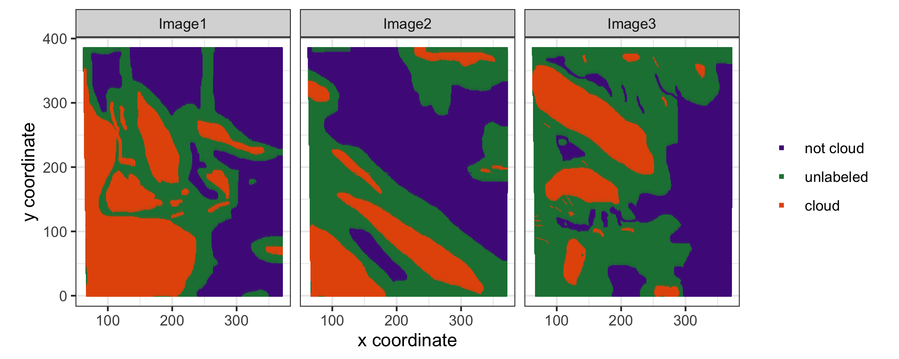
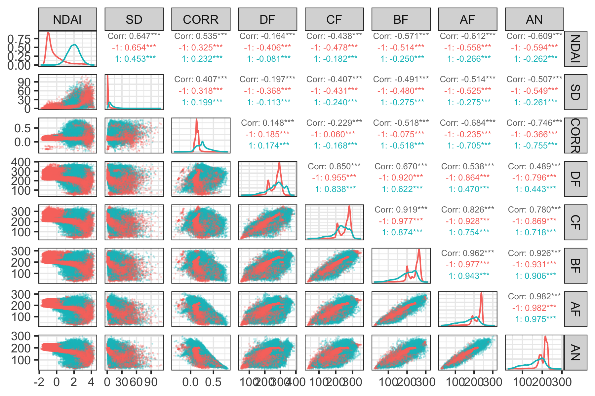
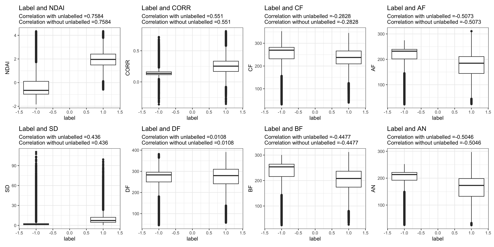
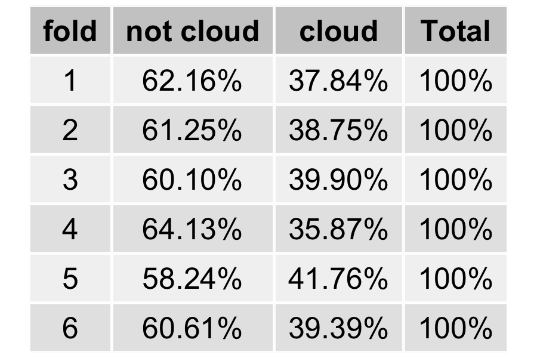
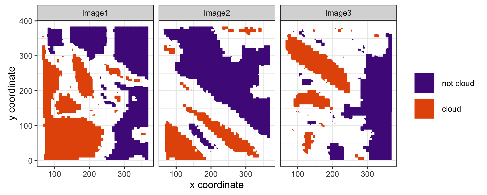
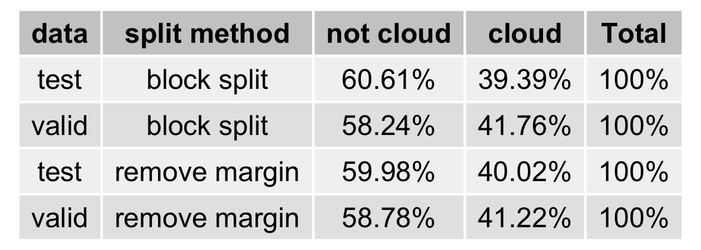
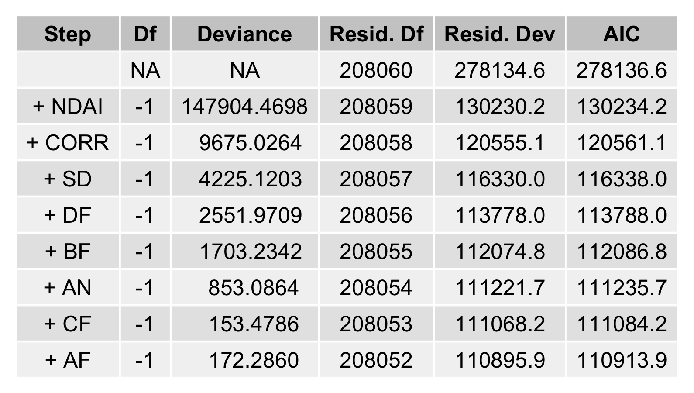
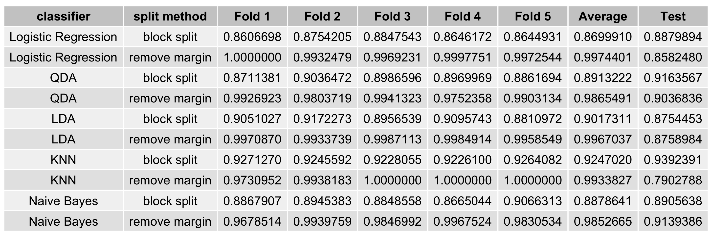

```{r setup, message=F, warning=F, echo=F}
require(tidyverse)
require(rstanarm)
require(magrittr)
require(rstan)
require(plyr)
require(patchwork)
require(scales)
require(psych)
require(GGally)
require(gridExtra)
require(MASS)
require(e1071)
require(adabag)
require(class)
ggplot2::theme_set(ggplot2::theme_bw())
knitr::opts_chunk$set(fig.align = 'center')
```


## 1 Data Collection and Exploration

### (a)

The key purpose of the paper *Daytime Arctic Cloud Detection Based on Multi-Angle Satellite Data With Case Studies* is to build an algorithm in order to ascertain whether a pixel of satellite images of Arctic is covered by cloud or not. Since the surfaces of cloud in Arctic are similar to those of Arctic surface, it is challenging to tell the difference between cloud and Arctic surface. The satellite images or the data used by the authors are shot by NASA Terra Satellite. The satellite comprises nine cameras with nine different angles in four spectral bands.

The data are collected from 10 MISR (Multiangle Imaging Spectro Radiometer) orbits of path 26 over the Arctic, northern Greenland, and Baffin Bay. This path is selected due to its richness of surface features. Six data units from each orbit are included in this study, and three of the total 60 units are excluded since the sea ice melts in the summer and affect the MISR operational algorithm. To evaluate the performance of the study, one of the authors hand-labels the image pixels as either clear or cloudy. Around 71.5% (5086002) of the pixels are labeled in total; the others are left unlabeled due to ambiguity.

The authors develop a classifying algorithm using enhances linear correlation matching (ELCM) and quadratic discriminant analysis (QDA) with three features (the linear correlation of radiation measurements from different MISR view directions, the standard deviation of MISR red radiation measurements, and the normalized difference angular index). As a result, the algorithm performs much better than other existing MISR operational algorithms. The study itself is also significant since the whole study only included three features and relatively simple classifying methods to separate clear and cloud regions. Potentially, a more efficient and accurate classifying algorithm for Arctic cloud will eventually enable the scientific community to have more accurate global climate model simulations.

### (b)

Percentages of pixels for difference classes for each image are shown in Figure \@ref(fig:percent-table). In Image1, the percentage of each class is relatively even. In Image2, the distribution of pixels on three classes is imbalanced. 43.78% of pixels in Image2 are not cloud, while only 17.77% pixels are cloud. In image3, though it has a more imbalanced distribution compared with Image3, most of the imbalance comes from unlabeled class, which is irrelevant to the training process.

```{r percent-table,fig.cap="Percentage of Percentage of not cloud, unlabeled and cloud for each image.",echo=FALSE,out.width="50%"}
 
```

Well-labeled maps are shown in Figure \@ref(fig:labeled-images). Based on the labeled map, the pixels show a sticky pattern in all three images. Meanwhile, cloud regions and clear regions are separated by unlabeled pixels. Therefore, i.i.d. assumption can't be justified for this data set.

```{r labeled-images,fig.cap="Image1-3 with expert labelled.",echo=FALSE}
 
```
### (c)

See Figure \@ref(fig:pairwise-correlations). 
```{r pairwise-correlations,fig.cap="Pairwise relationships between the three features", echo=FALSE,out.width="75%"}
 
```
See Figure \@ref(fig:label-feature1).
```{r label-feature1,fig.cap="Boxplots of label verse each feature, with unlabelled data removed. Correlations of label and each feature with and without unlabeled data. ", echo=FALSE}
 
```

## 2 Preparation

### (a)

For the three images in Figure \@ref(fig:labeled-images), each of them may have unique pattern. In case of over-fitting to one particular image, the combination of the three images is necessary before training. We also notice that there are some strong dependencies between one pixel and its neighbors. Therefore, we choose to split the  data set by block splitting, to avoid breaking its spatial structure. To be specific, we first divide the data set into numerous $8\times 8$ pixel blocks and for pixels in the same $8\times 8$ block, they are all assigned to one fold randomly chosen from $K$ folds, and the default value of $K$ is $6$, and unlabeled points are removed. Also, we don't desire that blocks at same location of different images are in the same fold, so the three data sets are grouped separately before combination. As a result of large number of blocks, percentages of all three labels (in Figure \@ref(fig:split-result)) are nearly even among different folds. After all, all blocks in fold $K$ are used for testing data, all blocks in fold $K-1$ are used for validation, and the rest are used for training data.

```{r split-result,fig.cap="Percentage of not cloud and cloud for fold1-6.",out.width="30%",echo=FALSE}
 
```

To enlarge the gap between the features of not cloud data and features of cloud data, we drop blocks which are not purely not cloud or cloud. it means that we drop all data points around the boundaries between different labels (in Figure \@ref(fig:margin-remove)), and everything else is the same as the first splitting method.

```{r margin-remove,fig.cap="Image1-3 with removing data points around the boundaries between labels and unlabelled pixels.",echo=FALSE}
 
```

### (b)

For test and validation data sets using either one of the two splitting methods, 

```{r trivial-classifier,fig.cap="Percentage of not cloud and cloud for validation set and test set of two split method.",out.width="50%",echo=FALSE}
 
```

### (c)

By performing the logistic regression forward selection on all features (in Figure \@ref(fig:best-features)), NDAI, CORR, and SD are three of the "best" features. With adding NDAI, CORR, and SD to the training model, AIC drop significantly.

```{r best-features,fig.cap="Result of logistic regression forward selection on all features." ,out.width="60%",echo=FALSE}
 
```

### (d)

The CVmaster function is in CVmaster.R.

## 3 Modeling

### (a)


```{r cv-acc,fig.cap="The accuracies across folds, the average accuracies across folds, and the test accurary for each classification model with two different splitting methods." ,out.width="100%",echo=FALSE}
 
```

```{r}

```


