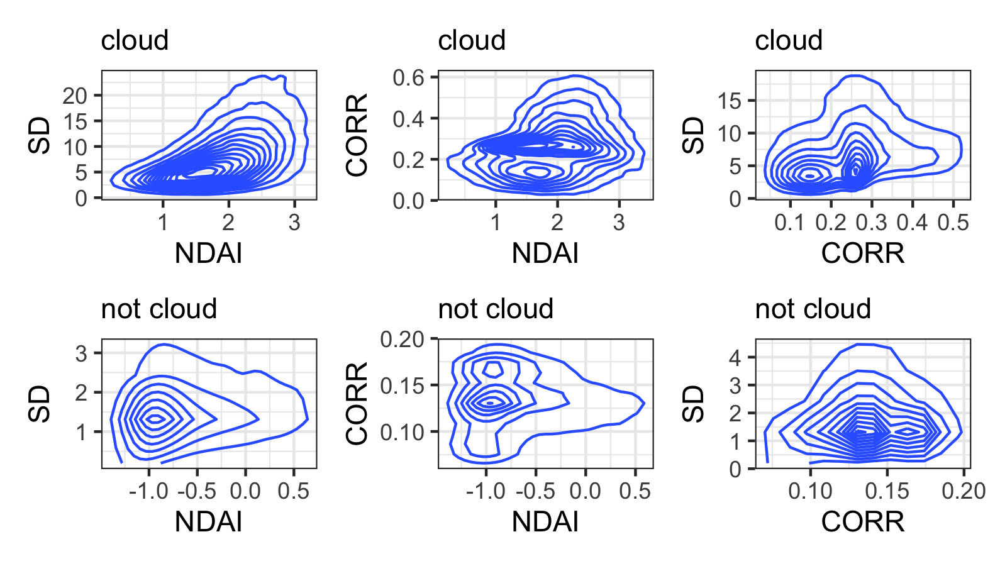
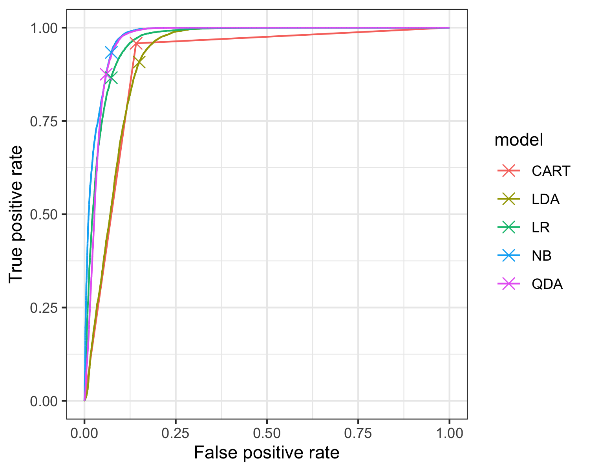
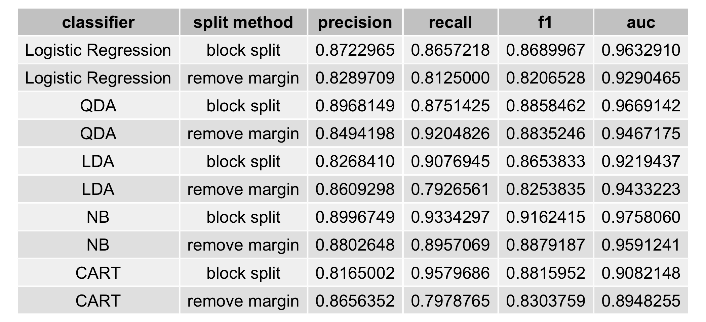
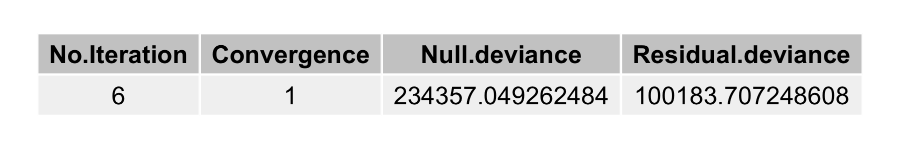
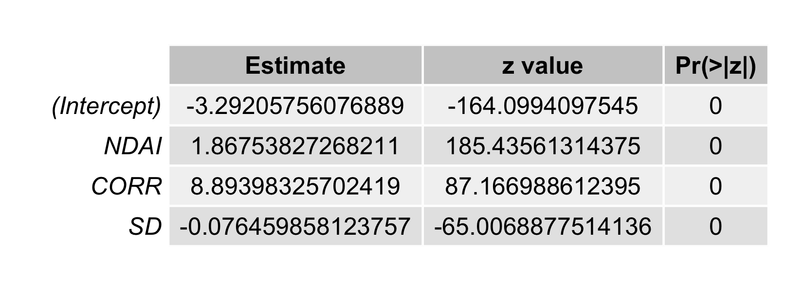
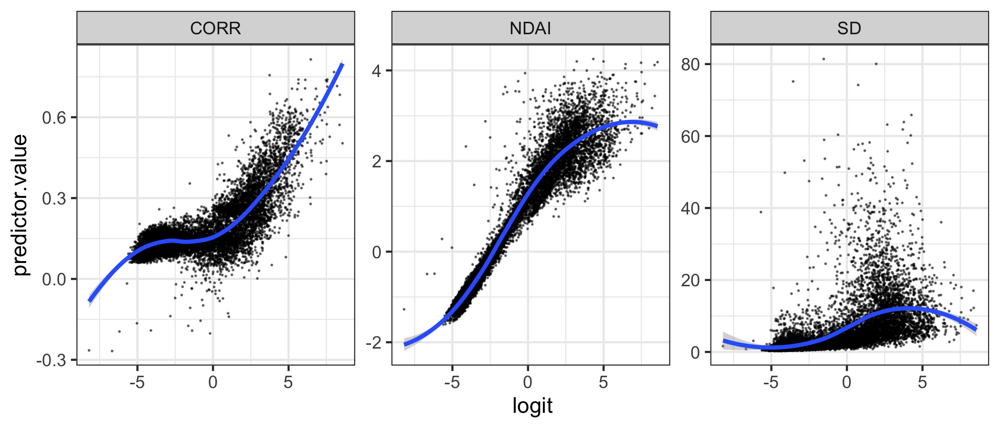
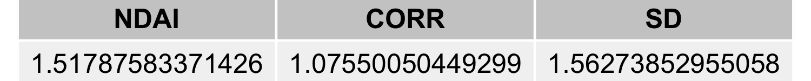
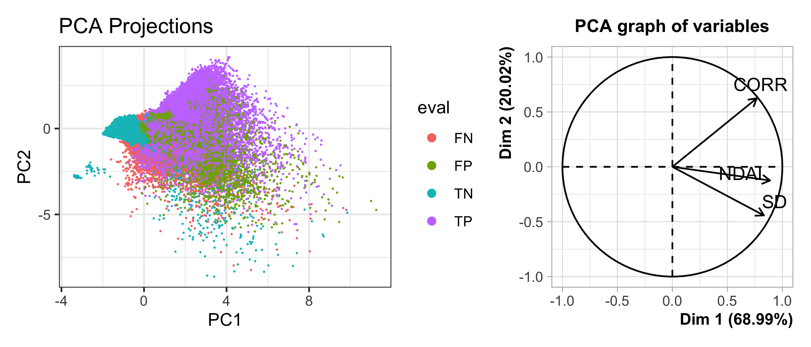

```{r setup, message=F, warning=F, echo=F}
require(tidyverse)
require(rstanarm)
require(magrittr)
require(rstan)
require(plyr)
require(patchwork)
require(scales)
require(psych)
require(GGally)
require(gridExtra)
require(MASS)
require(e1071)
require(adabag)
require(class)
require(caTools)
require(ROCR)
require(caret)
require(rpart)
require(car)
require(FactoMineR)
require(modeest)
require(randomForest)
ggplot2::theme_set(ggplot2::theme_bw())
knitr::opts_chunk$set(fig.align = 'center')
```


## 1 Data Collection and Exploration

### (a)

The key purpose of the paper *Daytime Arctic Cloud Detection Based on Multi-Angle Satellite Data With Case Studies* is to build an algorithm in order to ascertain whether a pixel of satellite images of Arctic is covered by cloud or not. Since the surfaces of cloud in Arctic are similar to those of the Arctic surface, it is challenging to tell the difference between cloud and Arctic surface. The satellite images or the data used by the authors are shot by NASA Terra Satellite. The satellite comprises nine cameras with nine different angles in four spectral bands.

The data are collected from 10 MISR (Multiangle Imaging Spectro Radiometer) orbits of path 26 over the Arctic, northern Greenland, and Baffin Bay. This path is selected due to its richness of surface features. Six data units from each orbit are included in this study, and three of the total 60 units are excluded since the sea ice melts in the summer and affect the MISR operational algorithm. To evaluate the performance of the study, one of the authors hand-labels the image pixels as either clear or cloudy. Around 71.5% (5086002) of the pixels are labeled in total; the others are left unlabeled due to ambiguity.

The authors develop a classifying algorithm using enhances linear correlation matching (ELCM) and quadratic discriminant analysis (QDA) with three features (the linear correlation of radiation measurements from different MISR view directions, the standard deviation of MISR red radiation measurements, and the normalized difference angular index). As a result, the algorithm performs much better than other existing MISR operational algorithms. The study itself is also significant since the whole study only included three features and relatively simple classifying methods to separate clear and cloud regions. Potentially, a more efficient and accurate classifying algorithm for Arctic cloud will eventually enable the scientific community to have more accurate global climate model simulations.

### (b)

Percentages of pixels for difference classes for each image are shown in Figure \@ref(fig:percent-table). In Image1, the percentage of each class is relatively even. In Image2, the distribution of pixels on three classes is imbalanced. 43.78% of pixels in Image2 are not cloud, while only 17.77% pixels are cloud. In image3, though it has a more imbalanced distribution compared with Image3, most of the imbalance comes from unlabeled class, which is irrelevant to the training process.

```{r percent-table,fig.cap="Percentage of Percentage of not cloud, unlabeled and cloud for each image.",echo=FALSE,out.width="50%"}
knitr::include_graphics("plot/percent-table.png") 
```

Well-labeled maps are shown in Figure \@ref(fig:labeled-images). Based on the labeled map, the pixels show a sticky pattern in all three images. Meanwhile, cloud regions and clear regions are separated by unlabeled pixels. Therefore, i.i.d. assumption can't be justified for this data set.

```{r labeled-images,fig.cap="Image1-3 with expert labelled.",echo=FALSE}
knitr::include_graphics("plot/labeled-images.png") 
```

### (c)

To perform a visual and quantitative EDA on the data set, we first combine the three images data set and remove all unlabeled data points. Then, we generate a plot with pairwise relationships between all eight features (in Figure \@ref(fig:pairwise-correlations)) and a group of box plots to show the relationship between each feature and the expert labels (in Figure \@ref(fig:label-feature1)). 

In upper part of the Figure \@ref(fig:pairwise-correlations), three correlations are presented for each pair of eight features. The first of the three correlation is computed with the whole data set. The second one is computed with data points labelled as not cloud and the third one is computed with data points labelled as cloud. 

In Figure \@ref(fig:label-feature1) and the 


```{r pairwise-correlations,fig.cap="Pairwise relationships between the three features", echo=FALSE,out.width="100%"}
knitr::include_graphics("plot/pairwise-correlations.png") 
```

```{r label-feature1,fig.cap="Boxplots of label verse each feature, with unlabelled data removed. Correlations of label and each feature with and without unlabeled data. ", echo=FALSE}
knitr::include_graphics("plot/label-feature1.png") 
```

## 2 Preparation

### (a)

For the three images in Figure \@ref(fig:labeled-images), each of them may have unique pattern. In case of over-fitting to one particular image, the combination of the three images is necessary before training. We also notice that there are some strong dependencies between one pixel and its neighbors. Therefore, we choose to split the  data set by block splitting, to avoid breaking its spatial structure. To be specific, we first divide the data set into numerous $8\times 8$ pixel blocks and for pixels in the same $8\times 8$ block, they are all assigned to one fold randomly chosen from $K$ folds, and the default value of $K$ is $6$, and unlabeled points are removed. Also, we don't desire that blocks at same location of different images are in the same fold, so the three data sets are grouped separately before combination. As a result of large number of blocks, percentages of all three labels (in Figure \@ref(fig:split-result)) are nearly even among different folds. After all, all blocks in fold $K$ are used for testing data, all blocks in fold $K-1$ are used for validation, and the rest are used for training data.

```{r split-result,fig.cap="Percentage of not cloud and cloud for fold1-6.",out.width="30%",echo=FALSE}
knitr::include_graphics("plot/split-result.png") 
```

To enlarge the gap between the features of not cloud data and features of cloud data, we drop blocks which are not purely not cloud or cloud. it means that we drop all data points around the boundaries between different labels (in Figure \@ref(fig:margin-remove)), and everything else is the same as the first splitting method.

```{r margin-remove,fig.cap="Image1-3 with removing data points around the boundaries between labels and unlabelled pixels.",echo=FALSE}
knitr::include_graphics("plot/margin-remove.png") 
```

### (b)

For test and validation data sets using either one of the two splitting methods, the percentage of not cloud is all around $60%$ (in Figure \@ref(fig:trivial-classifier)). Therefore, the accuracy of a trivial classifier, which sets all labels to $-1$, would also be around $60%$ for the validation set and test set, regardless of splitting method. The accuracy of a trivial classifier would be high, if the data set is imbalanced. For example, if $99%$ of the data set are labelled as not cloud, the accuracy of the trivial classifier would be $99%$. Concretely, our data sets are relatively balanced, so more fancier classifiers are necessary to achieve a higher accuracy. 

```{r trivial-classifier,fig.cap="Percentage of not cloud and cloud for validation set and test set of two split method.",out.width="50%",echo=FALSE}
knitr::include_graphics("plot/trivial-classifier.png") 
```

### (c)

By performing the logistic regression forward selection on all features (in Figure \@ref(fig:best-features)), NDAI, CORR, and SD are three of the "best" features. With adding NDAI, CORR, and SD to the training model, AIC drops significantly. According to *Daytime Arctic Cloud Detection Based on Multi-Angle Satellite Data With Case Studies*, these three features are computed with all radiations of nine angels, so these three features include some information of the other features, DF, BF, AN, CF and AF. Also, the three features of each pixel are based on the nine radiation values of pixels around that pixel, so these three features also include some information of its neighbors. As a result, neighbors are more likely to be classified into the same category. In the following questions, only these three features are used to train classification models.

```{r best-features,fig.cap="Result of logistic regression forward selection on all features." ,out.width="60%",echo=FALSE}
knitr::include_graphics("plot/best-features.png") 
```

### (d)

CVmaster function is in CVmaster.R.

## 3 Modeling

### (a)

Selected classification models are Logistic Regression(LR), Linear Discriminant Analysis(LDA), Quadratic Discriminant Analysis(QDA), Naive Bayes(NB) and Classification and Regression Tree(CART). Logistic Regression is the classification model with mainly two assumptions. The first is that the response variable (class) follows a Bernoulli distribution. The second is that the log-odds of this Bernoulli variable is linear with respect to covariates. This linear assumption, as indicated by part4(a) in the next section, is reasonable but might not be accurate. Assumptions for LDA and QDA are the same: there is a data generating process behind the scenes. First, generate a class. Second, generate instance for the chosen class. Within each class, instances are normal distributed with different means. The difference of LDA and QDA lies in the fact that the covariance for different classes are the same for LDA while the covariance are different across classes for QDA. There is also a data generation process behind NB. The assumption here is that coviarates are generated independently within each class. As can be seen from Figure \@ref(fig:density), distributions of covariates are not normal within each class, nor are they independent in general. Some of the distributions are bimodal, which are far from Gaussian distribution while the distributions of NDAI and SD are quite close to Gaussian. The dependence of covariates can also be seen from GGPair plot as in Figure \@ref(fig:pairwise-correlations). It is interesting to observe that within each class the correlation between covaraites are actually smaller. The independence assumption of Naive Bayes is not perfectly accurate, but reasonable. For accuracy results, we can see that cross-validation mean accuracy is very close to test accuracy in general. This indicates that CV is a robust way of evaluating model performance. The top model is Naive Bayes according to test accuracy.

```{r cv-acc,fig.cap="The accuracies across folds, the average accuracies across folds, and the test accurary for each classification model with two different splitting methods." ,out.width="100%",echo=FALSE}
knitr::include_graphics("plot/cv-acc.png") 
```

```{r density,fig.cap="Distribution of covariates",out.width="70%",echo=FALSE}
 
```

### (b)

Cutoff values are selected based on maximum Youden's J Statistic (Youden's Index), which is defined as True Positive Rate(TPR) - False Positive Rate(FPR). Geometrically it indicates the vertical distance right above the 45 degree line which represents ROC curve for a basic random model. As can be seen from the Figure \@ref(fig:roc), the selected cut-off points locate almost at the top-left corner of each ROC curve. This is preferred as we want to maintain relatively high TPR and low FPR at the same time.

```{r roc,fig.cap="ROC curve with cut-off values",out.width="70%",echo=FALSE}
 
```

### (c)

Other selected relevant metrics are precision, recall, f1 score and area under curve(AUC). Precision measures the ratio of correct prediction out of all positive predictions. In other words, precision measures quality of positive prediction. Recall measures the ratio of successfully predicted positive instances out of all positive instances. In other words, recall measures the ability to identify positive instances. F1 score is the harmonic mean of precision and recall, which can be seen as a comprehensive measurement regarding positive predictions combining both precision and recall. AUC measures area under ROC curve, which can be seen as a comprehensive measurement regarding the accuracy of positive predictions. Best model is again Naive Bayes, according to f1 score and AUC (Table \@ref(fig:prf)).

```{r prf,fig.cap="Distribution of covariates",out.width="70%",echo=FALSE}
 
```

## 4 Diagnostics

### (a)

From optimization perspective, the objective function of logistic regression loss is convex. According to Table \@ref(fig:lr_smr), parameters converged after 6 steps and achieves global minimum. From the effectiveness perspective, the model works effectively as there is a huge drop from null deviance to residual deviance, indicating tremendous gain from logsitic regression model compared to a plain constant model. From validity perspective, all the coefficients are statistically significant. The p-values are too small that they become numerically 0 (Table \@ref(fig:lr_coef). To test the linear assumption, scatter plots of predicted log-odds and covariates (Figure \@ref(fig:lr_linearity)) are plotted. Strict linearity should not be expected as the linearity is with respect to all covariates while each scatter plots only demonstrate the relationship between one log-odds and one variable. Therefore, a smooth estimation is made to demonstrate the trend. As can be seen, there is linear relationship with respect to NDAI and CORR, but not for SD. Training data does not align with linear assumption perfectly. Besides linearity assumption, collinearity is also crucial for linear models. We adopted variance inflation factors to test collinearity among covariates (Table \@ref(fig:lr_collinearity)). Since as a rule of thumb VIF value that exceeds 5 or 10 indicates a problematic amount of collinearity, there is not collinearity issue in training data. In the end, we try to visualize decision boundary in two-dimension space using PCA, but the projected data indicates that there does not exists such boundary in lower dimensional space (Figure \@ref(fig:lr_pca)). The evidence is that predicted positive and negative labels mix together. We cannot determine the predicted label of a given lower-space point. This makes sense if we notice that the decision boundary in 3-dimensional space is 2-dimensional, the projection of which should also be 2-dimensional.

```{r lr-smr,fig.cap="Summary of logistic regression model",out.width="70%",echo=FALSE}
 
```

```{r lr-coef,fig.cap="Coefficients of logistic regression model",out.width="70%",echo=FALSE}
 
```

```{r lr-linearity,fig.cap="Linearity test for logistic regression model",out.width="70%",echo=FALSE}
 
```

```{r lr-collinearity,fig.cap="Collinearity test for logistic regression model",out.width="70%",echo=FALSE}
 
```

```{r lr-pca,fig.cap="PCA for logistic regression model",out.width="70%",echo=FALSE}
 
```

### (b)


